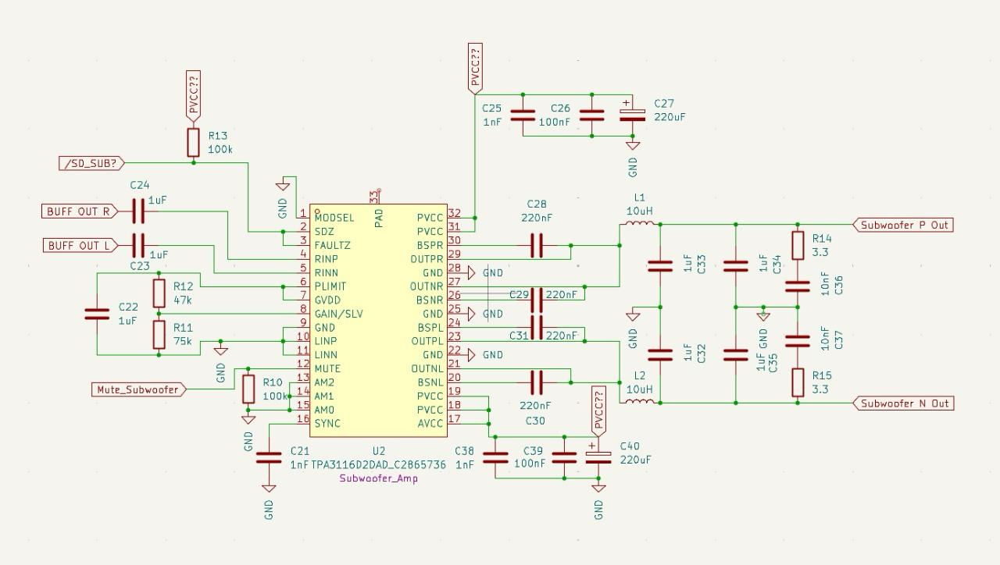
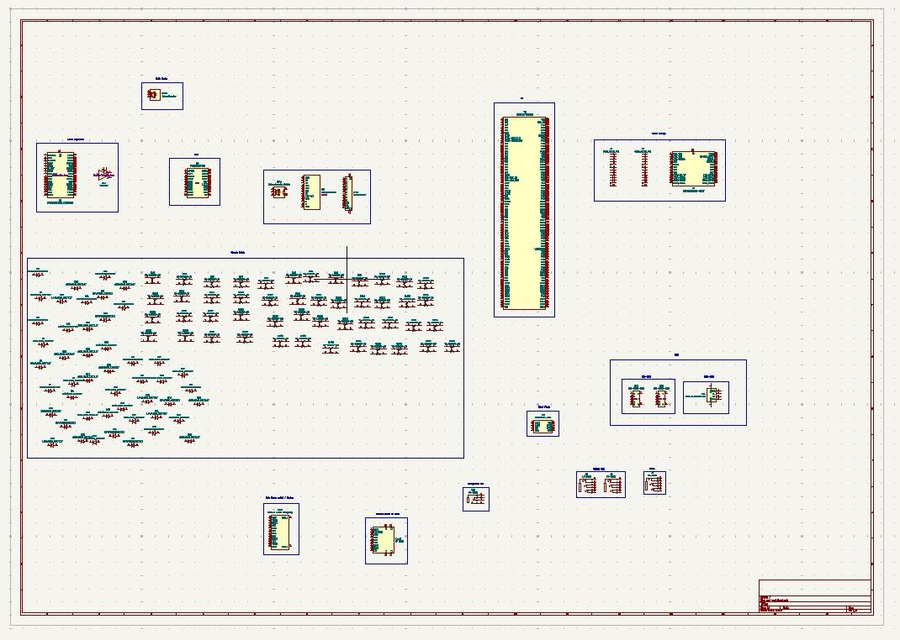
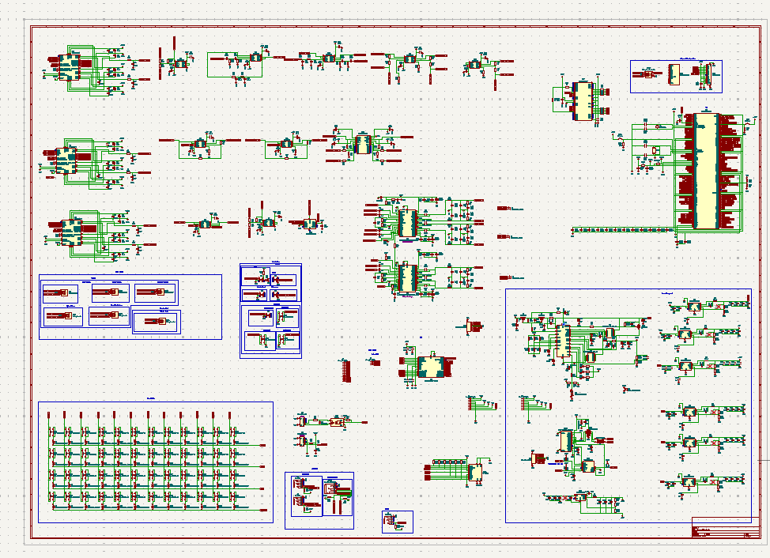
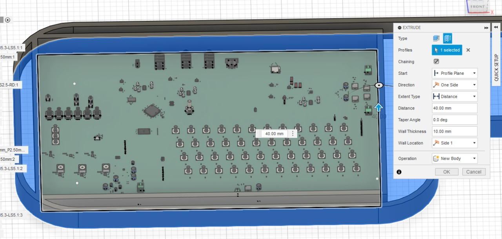

# July 14: Planning

I have always been in love with music, so much so that I recently found a cool instrument that was made a while back called an omnichord. For those who don't know what it is, it's a musical instrument that allows you to play synth chords while overlaying notes of the chord among other functionality. It has a unique sound and there aren't really any other "instruments" that come close to it. I wanted to have one, but there was a problem: they don't make them anymore and the current ones cost upwards of hundreds of dollars (which I don't have), so I decided to make my own.

I wanted my omnichord to be a mashup of all the previous omnichords, including all of their functionality and also bringing a few modern bits like a display and maybe bluetooth.

Then I created a Google Drive folder and started compiling the schematics for later reference.

**Hours: 6**

# July 15: Reading Manuals

After compiling the manuals, I went through the laborious task of reading all of them and compiling a list of features that each one had and their pros and cons. I compiled this list into a Google Docs document.

Now that I had the comprehensive list of features that I wanted to add, I started work on finding the right components.

**Hours: 7**

# July 18: Learning and Component Selection

For reference, this is my first big project, so I had no idea what I was doing. I started watching tutorials. After looking through the schematic of the original omnichord, I found that they used custom ICs and clocks to generate the waves to create the audio. I needed a way to replicate this but also make it modern, so I looked to my guitar amp, which is a Fender Mustang. The Fender Mustang has a screen and a cool pushbutton rotary encoder, so I wanted to incorporate that into the omnichord as well.

After watching several teardown videos, I saw that it uses an STM32H7 chip, and I've heard that those are pretty fast and have a lot of GPIO, so that's what I wanted to use.

**Hours: 7**

# July 19: More Component Selection

I wanted to have 3 speakers: a subwoofer, woofer, and tweeter. I also wanted a stereo out and a headphones out. All this could have been too much current for just one DAC, so I had to add sufficient DACs. This led me to spend a long time searching through the datasheets and learning about the different classes of DACs and amps. I finally ended up with a DAC named PCM5122PW and a class D amp called TPA3116D2DAD from Texas Instruments (I love Texas Instruments). These I have seen to be widely used and they have good support, so I added them to the schematic.

**Hours: 7**

# July 20: I/O

After adding the DACs, I started work on the different audio connectors that I wanted to add. Besides the ones mentioned before, i also wanted to add a midi in/midi out. I then researched and found out that MIDI is basically fancy UART, so I found a connector on LCSC and added it to the schematic (I'm reading the datasheets later). Then I found some jacks and added them as well. I wanted this feature so that when you plug only one line in, it's mono, and if you plug both then it's stereo, so I added a multiplexer TS5A23159RSER.

After re-reading over my work from the days before, I started having doubts about the audio quality, so I asked a teacher that studied electronic engineering and he said that I might need a buffer so that the sound signal has strength and isn't noisy or weak. I spent the rest of the day researching buffers and adding one into the schematic, so I chose the NE5532DR.

**Hours: 7**

# July 21: Biggest issue

After adding the DAC, and finish all the buffering and filtering of the different audio systems incorporated, i wanted to finally solve the problem: how would the user control the volume? I first thought about pots, which are usually whats used in DIY proyects. The problem with pots was that if i used actual pots with knobs, then the user would need to separatly control the headphones volume, the stereo out volume, and the speakers volume, which i didn't want. Also, i think finding log taper pots in lcsc is quite the challenge, which is crucial for a good volume gradient. Plan B was using digipots, but there arent any good audio quality digipots in the market for some reason. I then asked myself: how do car audio systems work? how is volume handled profesionally? I finally found that you could control it from the DAC, as long as it had a I2C to get all this info from the MCU. Because of this, I ended up updating all three DACs from PCM5102A to PCM5122. This took me a lot of time to solve.

# July 22: Buttons and Switches

I wanted to have enough buttons and stuff to make a bunch of chord combinations, so I made 4 rows of 12 buttons, one for each note, and each row corresponds to major, minor, 7th, and extensions.

I used Cherry MX keys as I had experience with them from making a hackpad.

**Hours: 5**

# July 23-25: Power

I wanted this omnichord to be mobile, so I had to add batteries, and if I added batteries then I needed a battery charging circuit (Texas Instruments to the rescue). I added a nice battery charging circuit (BQ24610). It was then that I realized that I needed 12V to power all of the speakers and DACs, so I had to create various buck converters and boost converters to convert from 12V to 15V, 3.3V, and 5V. I also was worried about the amperage, so I added various components in parallel to feed into the 5A that the DACs and amps needed. This took me a while to find the components because I first thought I needed 3.3V but then had the realization that audio needs a lot of power.

**Hours: 21** (7 hours each day)

# July 26: Power Continued and Other I/O

I needed a way to program the STM, so I added USB-C, and I wanted to be able to power the batteries for the amps, so I had to add a USB-C power negotiator circuit.

After that, I wanted to add more rotaries and an LED screen with a header, so I was working on that.

**Hours: 7**

# July 26-30: Datasheet Analysis and Finish Schematic

After placing all of the components, I had to connect all of the components, so I read through all the datasheets and pulled a few all-nighters to do that. I ended up using all 144 pins on the STM32H7 and struggled a bit with the power placement.

**Hours: 28** (7 hours each day for 4 days)

# July 31: Final Stretch

I finally finished the schematic and in a frenzy started wiring the PCB. I used FreeRouter and wired the components up, although I plan on making it better later, but I had to submit because of the deadline. I then went to Fusion and designed the case and finished up the project.

**Hours: 5**

---

**_Total Hours: 110_**
