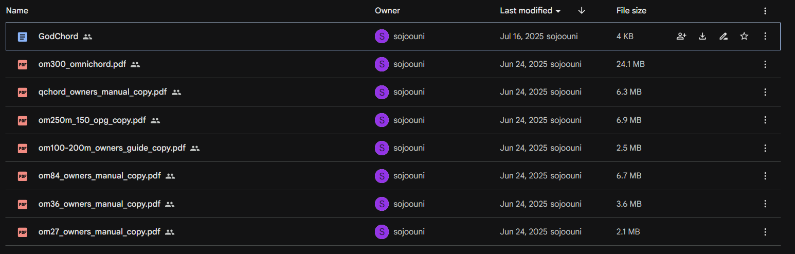
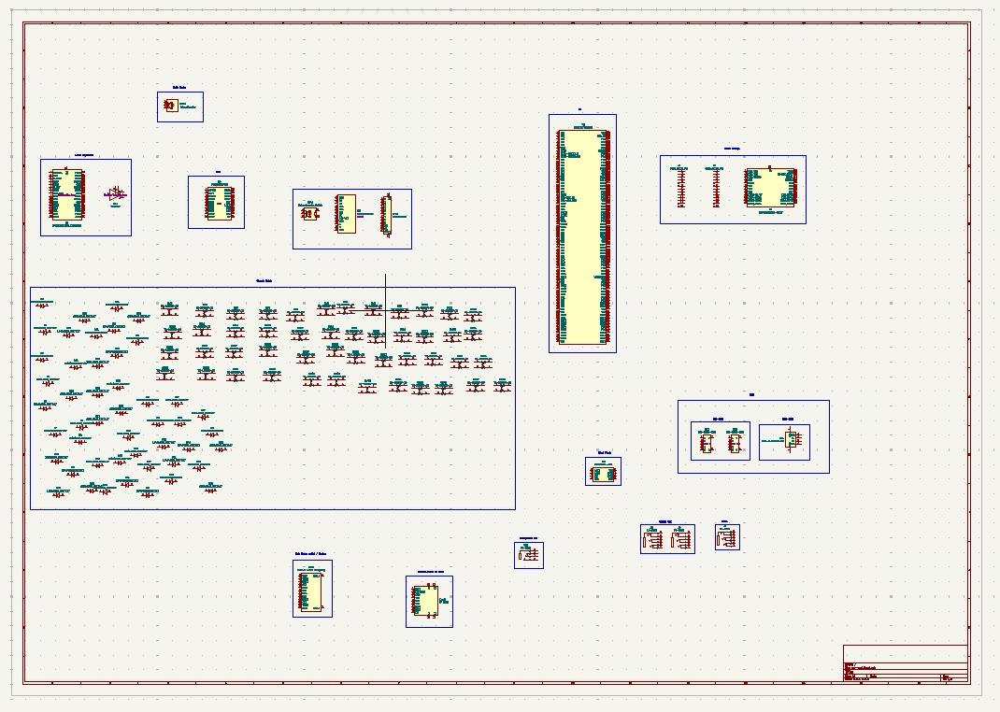
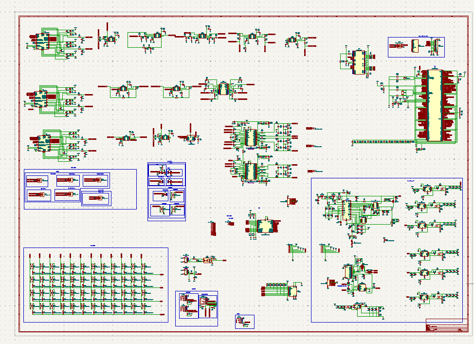
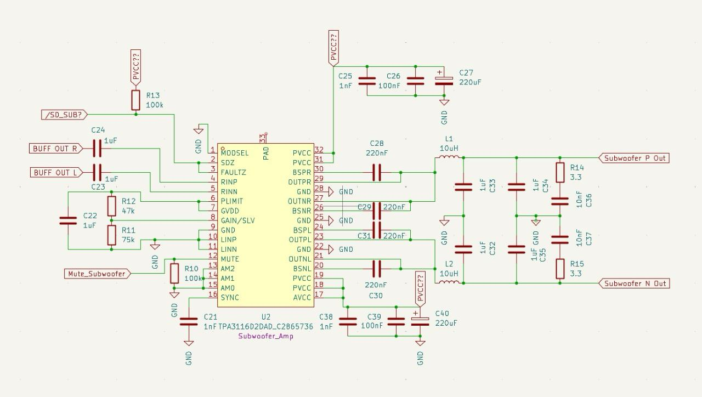
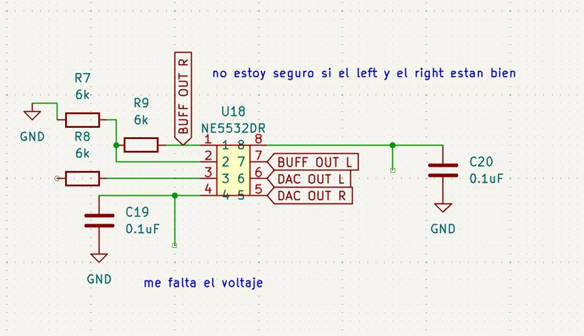
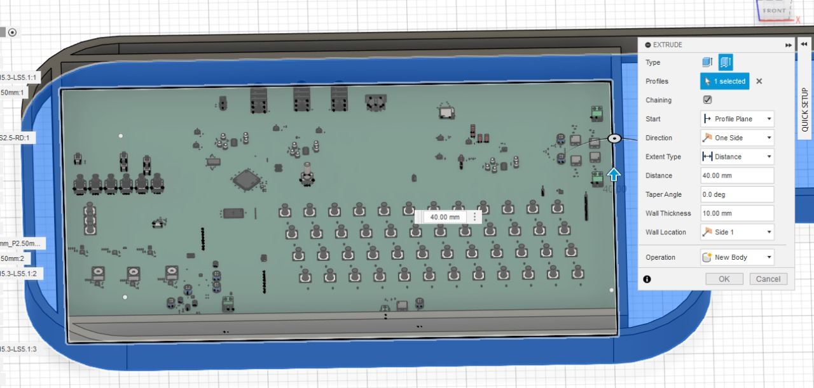

<h1 align="center">
   
  OM-GOD
   
</h1>

<h4 align="center">
Ominichord [Gate of Divinity]. Mash-up of all the previous omnichords and more.
</h4>

  <a href="#key-features">Key Features</a> •
  <a href="#design-process">Design Process</a> •
  <a href="#pcb">PCB</a> •
  <a href="#bom">BOM</a> •
  <a href="#journal">Development Journal</a> •
  <a href="#credits">Credits</a> •
  <a href="#license">License</a>

## Key Features

- **Multi-speaker audio system** with subwoofer, woofer, and tweeter
- **STM32H7 microcontroller** for high-performance processing
- **Texas Instruments DACs and amplifiers** for professional audio quality
- **MIDI connectivity** for external device integration
- **USB-C programming and power delivery**
- **Battery-powered portable design**
- **Cherry MX mechanical switches** for tactile feedback
- **48-button chord matrix** (4 rows × 12 buttons)
- **Rotary encoders** for parameter control
- **LED display** for status and settings

## Design Process

The OM-GOD project began with extensive research into existing omnichord designs and their features. After compiling schematics and manuals, I created a comprehensive feature list to guide the development process.

## PCB

Designed in KiCad with a focus on audio quality and modern features. Notable components:

- **STM32H7** microcontroller with 144 GPIO pins
- **PCM5122PW DAC** for high-quality audio conversion
- **TPA3116D2DAD Class D amplifier** for powerful audio output
- **BQ24610** battery charging circuit for portable operation
- **Multiple voltage regulators** (12V, 15V, 5V, 3.3V)
- **USB-C power delivery** with negotiator circuit
- **NFC antenna** for contactless communication

### Schematic Development

The schematic evolved through multiple iterations, starting with basic component selection and progressing to a complete audio system with power management, I/O interfaces, and user controls.

### Component Integration

Key integration challenges included:

- Audio signal buffering for noise reduction
- Power distribution for multiple voltage rails
- Component placement optimization
- Signal integrity considerations

### Final Design

The final design incorporates all planned features while maintaining a compact, portable form factor suitable for live performance.

## BOM

| Component  | Source        | Cost (USD)  |
| ---------  | ------        | ----------- |
| PCB        | JLCPCB        | $348.25     |
| SPEAKER    | MERCADO LIBRE | $7.00       |
| FLEX CABLE | MERCADO LIBRE | $4.15       |
| **Total**  |               | **359.4** |

_Note: Speakers, keycaps, and case are already owned components from previous projects._

## Credits

This project uses:

- [KiCad](https://www.kicad.org/) - PCB design
- [STM32](https://www.st.com/en/microcontrollers-microprocessors/stm32h7-series.html) - Microcontroller
- [Texas Instruments](https://www.ti.com/) - Audio and power components
- [Fusion 360](https://www.autodesk.com/products/fusion-360/) - 3D modeling

## License

MIT

---

> GitHub [@Sojooo](https://github.com/Sojooo)
